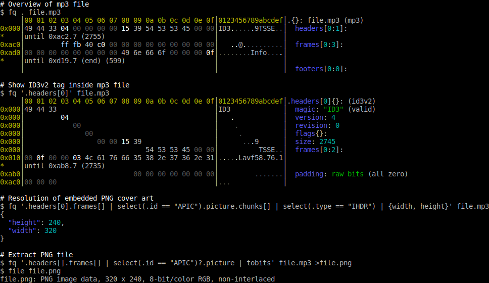

# Go语言爱好者周刊：第 132 期

这里记录每周值得分享的 Go 语言相关内容，周日发布。

本周刊开源（GitHub：[polaris1119/golangweekly](https://github.com/polaris1119/golangweekly)），欢迎投稿，推荐或自荐文章/软件/资源等，请[提交 issue](https://github.com/polaris1119/golangweekly/issues) 。

鉴于一些人可能没法坚持把英文文章看完，因此，周刊中会尽可能推荐优质的中文文章。优秀的英文文章，我们的 GCTT 组织会进行翻译。


题图：冬奥会闭幕，完美九宫格。

## 刊首语

简单解释下上期题目。以下代码输出什么？

```go
package main

import (
	"fmt"
	"time"
)

func main() {
	ch := make(chan bool)
	go func() {
		<-ch
		fmt.Print("Goroutine")
	}()
	time.Sleep(2 * time.Second)
	close(ch)
	time.Sleep(3 * time.Second)
	fmt.Print("Main")
}
```

A：Groutine；B：Main；C：Goroutine；D：GoroutineMain

正确答案：D。考点在于 close channel 后，<-ch 会立马返回。

本期题目来自微信群里朋友的一个提问，稍作修改。以下代码输出什么？

```go
package main

import (
	"fmt"
)

func main() {
	a := make([]int, 0, 5)
	addElem(a, 5)
	fmt.Println(a)
}

func addElem(a []int, i int) {
	a = append(a, 5)
}
```

A：[]；B：[5]；C：[5 0 0 0 0]；D：[0 0 0 0 0]

## 资讯

1、[bubbletea 0.20.0 发布](https://github.com/charmbracelet/bubbletea)

强大 TUI 框架。

2、[Go1.18 RC1 发布：正式版不远了](https://mp.weixin.qq.com/s/_ghANqHEJOwEdXo-l1aGlQ)

Go 1.18 终于迎来了 RC 版本，离正式发布越来越近了，预计会再发一个 RC2，然后就是正式版本了。这次正式版本稍微有点 Delay，预计 3 月份发布。

## 文章

1、[跟着 Go 作者学泛型](https://mp.weixin.qq.com/s/cLxQrgNfydzCqIQ3lsdzYg)

在 GopherCon 2021 年大会上，Go 两位作者 Robert Griesemer 和 Ian Lance Taylor 做了泛型相关的演讲，即将在 Go1.18 发布的 Go 泛型，正是两位设计的。

2、[Go 分布式令牌桶限流 + 兜底保障](https://mp.weixin.qq.com/s/sAYaIprZDCjVEJT4TNTzXg)

本文讲述的令牌桶线路算法可以比较好的处理固定时间窗口限流无法处理突然请求洪峰情况。

3、[把Go的BoltDB用在生产环境，结果18000台服务器瘫痪了](https://mp.weixin.qq.com/s/xZTZj94nHwVh-sLHcrZmag)

BoltDB 设计有些问题。

4、[带你十天轻松搞定 Go 微服务系列](https://mp.weixin.qq.com/s/oRX-OUOP9Ak5R1MEHRU5gg)

系列文章跟大家详细展示一个 go-zero 微服务示例，整个系列分十篇文章。

5、[通过 eBPF 深入探究 Go GC](https://mp.weixin.qq.com/s/Nx5yLo80nCtTuSD_34HN4w)

本文将使用 eBPF uprobes 检测 Go 垃圾收集器。

6、[程序员技术选型：写Go还是Java？网友：Rust不香？](https://mp.weixin.qq.com/s/Xw6QKXWqueQfiQp5c1QumQ)

本文作者根据自己的使用体验，详细对比了 Go 和 Java 的使用差异，给了开发者们一个中肯的选用参考。

7、[教妹子学 Go 并发原语：啥是 Semaphore ？](https://mp.weixin.qq.com/s/mXLJBmjMl05s-aMEcECeBw)

信号量是并发编程中常见的同步机制，在标准库的并发原语中使用频繁，比如 Mutex、WaitGroup 等，这些并发原语的实现都有信号量的影子，所以我们很有必要学好弄清楚信号量的实现原理，做到“知其然，更要知其所以然”。

## 开源项目

1、[fq](https://github.com/wader/fq)

类似 jq，但用于二进制文件。



2、[XMM](https://github.com/heiyeluren/XMM)

完美逃逸 Go GC 机制的 Go 内存管理器。

3、[tcg](https://github.com/msoap/tcg)

终端单元图形库。

4、[kita](https://github.com/zhuah/kita)

声明式、响应式 GUI 工具包，用于使用单一代码库构建基于 Web 技术的跨平台应用程序。

## 资源&&工具

1、[spew](https://github.com/spewerspew/spew)

为 Go 数据结构实现一个深度打印，以帮助调试。

2、[maintidx](https://github.com/yagipy/maintidx)

衡量每个 Go 函数的可维护性指数。

3、[播客第 215 期](https://changelog.com/gotime/215)

Go 与 MLOps。

4、[播客第 217 期](https://changelog.com/gotime/217)

Go1.18 中的其他特性。

5、[gitfofo](https://github.com/chenminhua/gitfofo)

利用 github api，帮你找到感兴趣的人。

## 订阅

这个周刊每周日发布，同步更新在[Go语言中文网](https://studygolang.com/go/weekly)和[微信公众号](https://weixin.sogou.com/weixin?query=Go%E8%AF%AD%E8%A8%80%E4%B8%AD%E6%96%87%E7%BD%91)。

微信搜索"Go语言中文网"或者扫描二维码，即可订阅。


